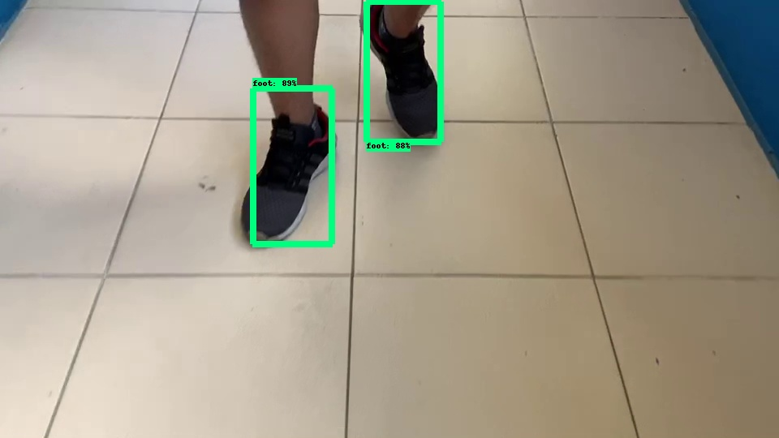
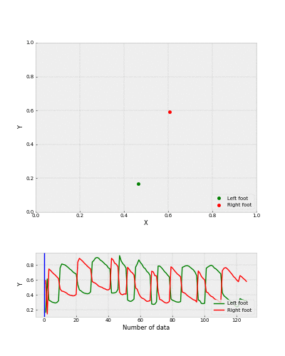

# Gait-measurement
#### Gait measurement with google tensorflow & tensorflow object detection api



### How to train new object detection model
1. use labelimg 

2. write label map file e: my_label.txt

3. follow command
```bash
$ python generate_tfrecord.py --csv_input=images/train_labels.csv --image_dir=images/train --output_path=train.record

$ python generate_tfrecord.py --csv_input=images/test_labels.csv --image_dir=images/test --output_path=test.record
```

4. Creating a training configuration, like faster_rcnn_inception_v2_pets.config or something

5. traing 
```bash
$ python model_main.py --logtostderr --model_dir=training/ --pipeline_config_path=training/faster_rcnn_inception_v2_pets.config
```

6. convert to pb 
```bash
$ python export_inference_graph.py --input_type image_tensor --pipeline_config_path ./my/ssdlite_mobilenet_v2_coco_2012/ssdlite_mobilenet_v2_coco_2012.config --trained_checkpoint_prefix ./tf_detection_model_zoo/blue_point/ model.ckpt --output_directory blue_point
```

7. convert to tflite(option)

8. run it
```python
python blue_point_video.py
```

#### Output

